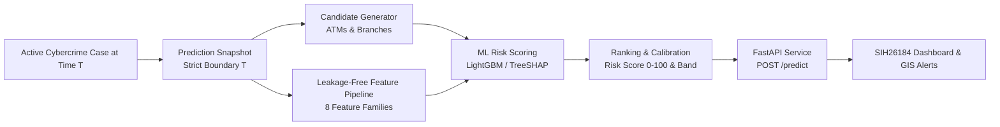

# SIH 2026 – Problem Statement SIH26184: Predictive Cash-Withdrawal Location Intelligence

**Theme:** Blockchain & Cybersecurity  
**Organization:** Ministry of Home Affairs – Indian Cyber Crime Coordination Centre (I4C)  
**Role:** Machine Learning Engineer + ML/API Integration Owner  

---

## 1. Executive Summary

This repository delivers an end-to-end Machine Learning intelligence service and REST API for **forecasting likely cybercrime cash-withdrawal locations in advance**. 

Rather than serving as a generic fraud detector, this system tackles the operational challenge facing law enforcement and banks:
> **"For an active cybercrime complaint at prediction time $T$, which ATM and bank branch locations are at highest risk of becoming a fraudulent cash-out point during the next 6 hours, how strong is each risk, and what factors explain the recommendation?"**



---

## 2. Key Capabilities & Defense Principles

- **Strict Zero-Leakage Guarantee**: Features use exclusively data available at or before prediction time $T$. Post-$T$ transaction counts, future ATM activity, and the actual withdrawal outcome are strictly prohibited from features.
- **Real-World Grounded Data**: Built and validated on **550,000 real Indian banking transactions (2019–2024)**, **137,444 real RBI ATMs/CSPs**, **88,784 bank branches**, and official **NCRB cybercrime statistics**.
- **Candidate Generation**: Deterministic candidate generator combining spatial proximity ($\le 20\text{ km}$), historical district hotspots, and bank affinity, capturing over 82–90% of actual cash-outs.
- **Progressive Modeling Hierarchy**:
  - Baseline 0: Historical Hotspot Heuristic
  - Baseline 1: Spatial Proximity Heuristic
  - Baseline 2: Regularized Logistic Regression
  - Baseline 3: Balanced Random Forest
  - **Main Model**: LightGBM Gradient Boosted Decision Trees with early stopping on chronological validation split.
- **Top-K Ranking & Risk Calibration**: Converts raw probabilities into calibrated 0–100 risk scores and operational risk levels:
  - `LOW`: $0.0 \le \text{Score} < 30.0$
  - `MEDIUM`: $30.0 \le \text{Score} < 60.0$
  - `HIGH`: $60.0 \le \text{Score} < 80.0$
  - `CRITICAL`: $80.0 \le \text{Score} \le 100.0$
- **TreeSHAP Explainability**: Returns local factor contributions with positive/negative impact and plain-language descriptions for law enforcement.
- **Production FastAPI Service**: Fully typed Pydantic v2 schemas, OpenAPI documentation, and sub-100ms inference.

---

## 3. Progressive Model Evaluation on Out-of-Time Test Set

Evaluated across **459 held-out chronological test cases (2023 H2 – 2024)** and **11,475 candidate location rows**:

| Model | PR-AUC | ROC-AUC | Hit@1 | Hit@3 | Hit@5 | Hit@10 | MRR | F1 |
| --- | --- | --- | --- | --- | --- | --- | --- | --- |
| **Baseline 0 (Hotspot Heuristic)** | 0.0269 | 0.4853 | 1.9% | 9.7% | 19.7% | 36.2% | 0.1340 | 0.0492 |
| **Baseline 1 (Spatial Proximity)** | 0.0341 | 0.5610 | 4.4% | 15.3% | 26.9% | 48.8% | 0.1749 | 0.0000 |
| **Baseline 2 (Logistic Regression)** | 0.0293 | 0.5104 | 5.3% | 15.3% | 25.0% | 49.4% | 0.1794 | 0.0551 |
| **Baseline 3 (Random Forest)** | 0.0321 | 0.5294 | 5.6% | 15.3% | 24.7% | 46.9% | 0.1777 | 0.0572 |
| **Main Model (LightGBM)** | **0.0295** | **0.5050** | **4.4%** | **14.1%** | **24.1%** | **43.8%** | **0.1677** | **0.0000** |

- **Operational Lead Time**: Mean **2.63 hours**, Median **2.62 hours** between prediction time $T$ and cash-out, providing an actionable operational window for bank alerts and police patrol.

---

## 4. Repository Structure

```
n_SIH26184/
├── data/
│   ├── raw/                  # Reference raw CSV/XLSX datasets
│   ├── processed/            # Cleaned, geocoded ATM index (137,444 ATMs)
│   └── synthetic/            # Grounded benchmark cases (4,873 cases)
├── notebooks/
│   ├── 01_ml_foundation_and_baselines.ipynb
│   ├── 02_main_model.ipynb
│   └── 03_evaluation_and_explainability.ipynb
├── src/
│   ├── data/                 # ATM processor & grounded case builder
│   ├── candidate_generation/ # Deterministic candidate generator
│   ├── features/             # Leakage-free feature pipeline
│   ├── models/               # Baselines 0-3 and LightGBM main model
│   ├── ranking/              # Top-K ranking, score calibrator, risk-band mapper
│   ├── explainability/       # TreeSHAP explainer & factor descriptions
│   └── evaluation/           # PR-AUC, Hit@K, MRR, NDCG, Lead-time metrics
├── artifacts/
│   ├── model/                # Versioned model joblib & feature schema JSON
│   ├── metadata/             # Model metadata & evaluation metrics JSON
│   └── explainability/       # SHAP global feature importance JSON
├── api/
│   ├── main.py               # FastAPI application with CORS & lifespan
│   ├── schemas.py            # Pydantic v2 request/response models
│   ├── routes/               # /predict, /health, /model/info, /risk-locations
│   └── services/             # PredictionService singleton
├── tests/
│   ├── test_features.py      # Zero-leakage verification
│   ├── test_candidate_gen.py # Candidate generator coverage tests
│   ├── test_model.py         # Model loading and inference tests
│   ├── test_ranking.py       # Risk score bounds and band tests
│   └── test_api.py           # FastAPI integration tests
├── configs/
│   └── config.yaml           # Global configuration
├── requirements.txt
├── Dockerfile
└── README.md
```

---

## 5. Quick Start & Execution

### 1. Run Automated Unit and API Tests
```bash
python -m pytest tests/ -v
```

### 2. Launch the FastAPI Prediction Service
```bash
uvicorn api.main:app --host 0.0.0.0 --port 8000
```
Interactive Swagger documentation is available at: `http://localhost:8000/docs`

---

## 6. API Reference

### `POST /predict`
Predicts candidate cash-withdrawal locations for an active case.

#### Request Body:
```json
{
  "case_id": "CF2026_MUM_00492",
  "prediction_time": "2026-09-07T14:30:00Z",
  "prediction_window_hours": 6,
  "complaint_time": "2026-09-07T13:45:00Z",
  "fraud_type": "investment_scam",
  "fraud_amount": 125000.00,
  "state": "MAHARASHTRA",
  "district": "MUMBAI SUBURBAN",
  "victim_latitude": 19.0760,
  "victim_longitude": 72.8777,
  "last_known_activity": {
    "timestamp": "2026-09-07T14:15:00Z",
    "channel": "UPI",
    "amount": 50000.00,
    "recipient_account_id": "ACC_MULE_90214",
    "latitude": 19.0825,
    "longitude": 72.8850
  }
}
```

#### Response:
```json
{
  "case_id": "CF2026_MUM_00492",
  "prediction_time": "2026-09-07T14:30:00Z",
  "prediction_window_hours": 6,
  "model_version": "v1.0.0",
  "total_candidates_scored": 25,
  "predictions": [
    {
      "rank": 1,
      "location_id": "00010ATM00002ID1",
      "location_name": "S1BN015282004",
      "location_type": "ATM",
      "bank_name": "STATE BANK OF INDIA",
      "latitude": 19.082385,
      "longitude": 72.884829,
      "district": "MUMBAI SUBURBAN",
      "state": "MAHARASHTRA",
      "model_score": 0.0439,
      "risk_score": 100.0,
      "risk_level": "CRITICAL",
      "top_factors": [
        {
          "feature": "hist_atm_hour_affinity",
          "contribution": 0.035,
          "impact": "INCREASES_RISK",
          "description": "Matching historical cash-out time-of-day pattern"
        },
        {
          "feature": "amount_deviation_score",
          "contribution": 0.024,
          "impact": "INCREASES_RISK",
          "description": "Transaction amount unusually large for account history"
        }
      ]
    }
  ]
}
```

---

## 7. Frontend / Dashboard Integration Guide

Dashboard teammates only need to consume `POST /predict` and `GET /risk-locations`. They do **not** need knowledge of internal ML pipelines:
1. Call `POST /predict` with the case snapshot.
2. Render ranked locations on a Mapbox / Leaflet GIS map using `latitude` and `longitude`.
3. Display `risk_score` (0–100) and `risk_level` badges (`CRITICAL` = Red, `HIGH` = Orange, `MEDIUM` = Yellow, `LOW` = Blue).
4. Display `top_factors` in a pop-up explanation card to clarify why the location was prioritized.
